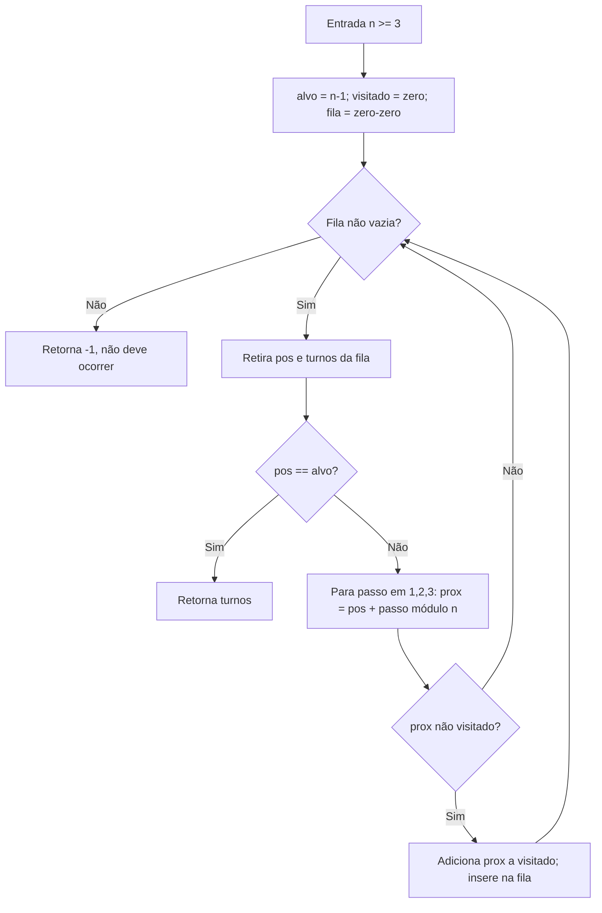
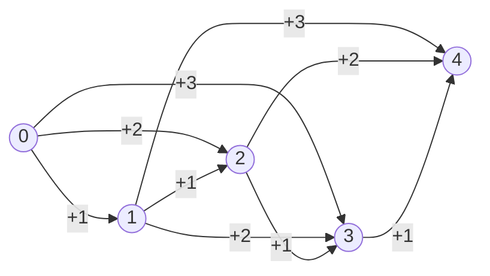

# Jogo do Tabuleiro Unidirecional — README

> **Objetivo**: Dado um tabuleiro unidirecional com `n` casas ($n\ge 3$), peças andam conforme uma roleta uniforme $\{1,2,3\}$. Se ultrapassar a última casa, a posição dá *loop* (volta ao início via módulo $n$). Este projeto calcula:
>
> 1. **Mínimo de turnos** para alcançar a última casa (caminho ótimo);
> 2. **Probabilidade** de executar algum **caminho ótimo** (em turnos mínimos);
> 3. **Número de combinações sem looping** (caminhos que nunca passam do fim antes de chegar).

---

## Sumário

* [Modelagem do problema](#modelagem-do-problema)
* [Ideias de solução](#ideias-de-solução)

  * [1) Mínimo de turnos (BFS + fórmula)](#1-mínimo-de-turnos-bfs--fórmula)
  * [2) Probabilidade do caminho ótimo (DP por camadas)](#2-probabilidade-do-caminho-ótimo-dp-por-camadas)
  * [3) Caminhos sem looping (Tribonacci)](#3-caminhos-sem-looping-tribonacci)
* [Como executar](#como-executar)
* [Exemplos de saída](#exemplos-de-saída)
* [Complexidade](#complexidade)
* [Extensões e observações](#extensões-e-observações)

---

## Modelagem do problema

* **Casas**: indexadas de `0` a `n-1`. A casa alvo é `n-1`.
* **Movimento**: a cada turno, sorteia-se $s\in\{1,2,3\}$ com probabilidade $1/3$ cada.
* **Loop (módulo)**: `pos = (pos + s) % n`.
* **Vitória**: atingir `pos == n-1`.

> Pensar como **grafo dirigido** com $n$ vértices, e de cada vértice saem 3 arestas ($+1, +2, +3$ módulo $n$). O problema (1) vira **menor caminho em número de arestas**. O (2) vira **contagem de caminhos mínimos**. O (3) é uma **contagem em linha** (sem usar módulo), até `n-1`.

---

## Ideias de solução

### 1) Mínimo de turnos (BFS + **fórmula**)

**Algoritmo implementado**: **BFS** (fila) a partir de `0`, visitando vizinhos `(pos+1)%n`, `(pos+2)%n`, `(pos+3)%n` até encontrar `n-1`.

**Fluxo (BFS):**



**Observação teórica (fórmula fechada):**

O menor número de turnos $t$ é o menor inteiro tal que existe uma soma $s$ de $t$ passos (cada um entre 1 e 3) com $s \equiv -1 \pmod n$. Tomando $s = n-1$ (sem loop), precisamos de $t$ com $t \le s \le 3t$.  

min_turns(n) = ⌈(n - 1) / 3⌉

Essa fórmula bate com o BFS e é útil para conferir resultados.

**Exemplos rápidos**:

* $n=3$ → $\lceil 2/3 \rceil = 1$
* $n=4$ → $\lceil 3/3 \rceil = 1$
* $n=5$ → $\lceil 4/3 \rceil = 2$
* $n=7$ → $\lceil 6/3 \rceil = 2$


**Exemplo de fluxo para n = 5:**


 ```mermaid
 flowchart TD
    subgraph Inicial
        A0[(0,0)] 
    end
    A0 --> B0["Fila após popleft: vazia; adiciona vizinhos (1,1), (2,1), (3,1)"]
    
    subgraph Turno_1
        B1[(1,1)]
        B2[(2,1)]
        B3[(3,1)]
    end
    B0 --> B1
    B0 --> B2
    B0 --> B3

    subgraph Turno_2
        C1[(2,2)]  --> D1["..."]
        C2[(3,2)]  
        C3[(4,2)]  --> D2["Alvo alcançado!"]
    end

    B1 --> C1
    B1 --> C2
    B1 --> C3

    B2 --> C1
    B2 --> C2
    B2 --> C3

    B3 --> C1
    B3 --> C2
    B3 --> C3
 ```

---

### 2) Probabilidade do caminho ótimo (DP por camadas)

Defina $T=\text{minTurns}(n)$. Cada sequência de $T$ sorteios tem probabilidade $(1/3)^T$. Queremos a **fração** das sequências que chegam exatamente a `n-1` em $T$ turnos.

**DP usada**:

* `dp[t][pos]` = número de maneiras de chegar em `pos` com exatamente `t` turnos.
* Transição: `dp[t+1][(pos+passo)%n] += dp[t][pos]` para passo em {1,2,3}.
* Resposta: `dp[T][n-1] / 3**T`.

**Exemplo (n=5)**:

* $T=2$. Sequências de 2 passos que caem em `4`: `(2,2)`, `(3,1)`, `(1,3)` → **3** de 9 → $\mathbf{1/3}$.

---

### 3) Caminhos **sem looping** (Tribonacci)

Agora ignoramos o módulo: **não pode ultrapassar `n-1` antes de chegar nele**. De `i` só podemos ir para `i+1`, `i+2` ou `i+3` **se** o destino $\le n-1$.

Seja $f(k)$ o número de formas de chegar ao índice $k$ sem loop.

* $f(0)=1$ (ponto de partida)
* $f(k)=0$ para $k<0$
* $\displaystyle f(k)=f(k-1)+f(k-2)+f(k-3)$
  → **Tribonacci**.
* Resposta: $\boxed{\,f(n-1)\,}$.

**Diagrama (ex.: n=5, alvo=4)**



Contando os caminhos até `4` nesse grafo dá `7` (coincide com o DP do código).

---

## Como executar

1. **Pré-requisito**: Python 3.8+
2. Execute o script (ajuste o caminho conforme seu projeto):

   ```bash
   python Problema3/Solution.py
   ```
3. Informe `n` quando solicitado ($n\ge 3$).

---

## Exemplos de saída

Para `n = 5`:

```
1) Mínimo de turnos para chegar à última casa: 2
2) Probabilidade de executar o caminho ótimo: 0.333333 (33.33%)
3) Número de combinações de movimentos sem looping: 7
```

Outros exemplos (comparativo):

|  n | min\_turns = ceil((n-1)/3) | prob. caminho ótimo | caminhos sem loop |
| -: | :------------------------: | :-----------------: | :---------------: |
|  3 |              1             |     1/3 ≈ 0.3333    |         2         |
|  4 |              1             |     1/3 ≈ 0.3333    |         4         |
|  5 |              2             |  3/9 = 1/3 ≈ 0.3333 |         7         |
|  6 |              2             |     2/9 ≈ 0.2222    |         13        |
|  7 |              2             |     1/9 ≈ 0.1111    |         24        |

> As probabilidades foram obtidas via `count_optimal_paths(n) / 3**min_turns`.

---

## Complexidade

* **`min_turns_tabuleiro` (BFS)**: tempo $\mathcal O(n)$, espaço $\mathcal O(n)$.

  * (Opcional) Usar diretamente a **fórmula** $\lceil (n-1)/3 \rceil$ evita BFS.
* **`count_optimal_paths` (DP por camadas)**: $\mathcal O(T\cdot n)$ em tempo e espaço, onde $T=\lceil (n-1)/3 \rceil$.
* **`prob_caminho_otimo`**: custo dominado por `count_optimal_paths`.
* **`count_no_loop_paths` (Tribonacci DP)**: $\mathcal O(n)$ tempo, $\mathcal O(n)$ espaço (pode ser $\mathcal O(1)$ com rotação de 3 estados).

---

## Extensões e observações

* **Generalização de passos**: trocando `{1,2,3}` por um conjunto qualquer `S`, o BFS e a DP continuam válidos (basta iterar `passo in S`).
* **Probabilidades não-uniformes**: se a roleta for viciada, bastaria ponderar as transições com as probabilidades correspondentes e ajustar o cálculo do item (2).
* **Fechando a conta do item (2)**: para $T=\lceil (n-1)/3 \rceil$, contar quantas sequências somam exatamente $n-1$ com $T$ termos em {1,2,3}. O código usa DP; uma abordagem combinatória fecha em multinomiais, mas é mais verbosa e suscetível a erro — DP é clara e segura.

---

### Estrutura das funções (resumo)

* `min_turns_tabuleiro(n)`: BFS até `n-1` (equivale a $\lceil (n-1)/3 \rceil$).
* `count_optimal_paths(n)`: DP em camadas até `T`, conta quantas sequências chegam ao alvo **em exatamente** `T` turnos.
* `prob_caminho_otimo(n)`: $\text{countOptimalPaths}(n) / 3^T$.
* `count_no_loop_paths(n)`: DP linear (Tribonacci) sem usar o módulo (não permite ultrapassar `n-1`).
* `main()`: orquestra as chamadas, valida entradas e imprime resultados.

---


